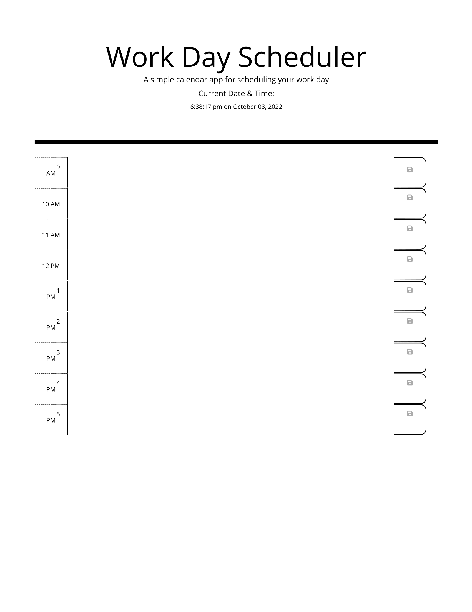

# Work Day Scheduler
Work Day Scheduling Application

## Description
This Work day scheduling application provides the user with the ability to add events to specific time blocks and then save this events to local storage. The application tracks the  current time and indicates to the user when an event has passed, currently active or is in the future using colour coordination.

## Requirements/Goal
AS AN employee with a busy schedule
I WANT to add important events to a daily planner
SO THAT I can manage my time effectively

## Acceptance Criteria
GIVEN I am using a daily planner to create a schedule
WHEN I open the planner
THEN the current day is displayed at the top of the calendar
WHEN I scroll down
THEN I am presented with time blocks for standard business hours
WHEN I view the time blocks for that day
THEN each time block is color-coded to indicate whether it is in the past, present, or future
WHEN I click into a time block
THEN I can enter an event
WHEN I click the save button for that time block
THEN the text for that event is saved in local storage
WHEN I refresh the page
THEN the saved events persist

## Installation
In order to run this application the user must open the index.html  file in their browser.

## Usage
Once text is typed into the textbox. The button on the right can be clicked  to save the text contents to local storage. 

## Application
URL: https://derrick-edowen.github.io/Work-Day-Scheduler/

## Credits
Starter Code acquired from: (https://github.com/coding-boot-camp/super-disco.git)

## License
N/A